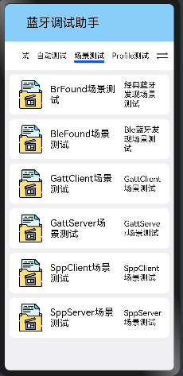
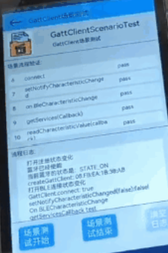
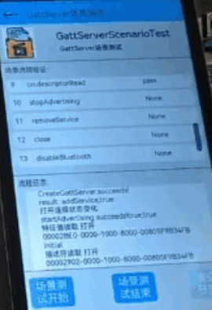

## 场景测试使用说明文档

​      本文档主要介绍了蓝牙专项测试程序的场景测试模块的功能使用说明。

### 场景测试界面

​       本程序的场景测试实现的是可以在点击一次"场景测试"按钮后，调用对应api实现一个较为简单的实际场景，并将所有返回值显示出来。如：经典蓝牙类实现的是一个简单的蓝牙发现的场景；BLE类实现的是一个搜索BLE的场景；gatt类实现的是一个gatt连接的场景；spp类实现的是一个spp连接的场景。

#### 1. BrFound场景测试（ohos.bluetooth.d.ts）

​        进入界面后，点击"场景测试开始"按钮，遍历测试ohos.bluetooth.d.ts中经典蓝牙类所需要的接口，测试顺序有一定的逻辑先后关系，自动完成一套蓝牙发现的场景测试，会显示相应的调用传值结果。再点击"场景测试结束"按钮，完成断开连接，关闭蓝牙等一系列结束操作。保证可以重复正常进行场景测试。

#### 2. BrFoundManager场景测试（ohos.bluetoothManager.d.ts）

​        进入界面后，点击"场景测试开始"按钮，遍历测试ohos.bluetoothManager.d.ts中经典蓝牙类所需要的接口，测试顺序有一定的逻辑先后关系，自动完成一套蓝牙发现的场景测试，会显示相应的调用传值结果。再点击"场景测试结束"按钮，完成断开连接，关闭蓝牙等一系列结束操作。保证可以重复正常进行场景测试。

#### 3. BleFound场景测试（ohos.bluetooth.d.ts）

​        进入界面后，点击"场景测试开始"按钮，遍历测试ohos.bluetooth.d.ts中BLE类所需要的接口，测试顺序有一定的逻辑先后关系，自动完成一套BLE发现的场景测试，会显示相应的调用传值结果。再点击"场景测试结束"按钮，完成断开连接，关闭蓝牙等一系列结束操作。保证可以重复正常进行场景测试。

#### 4. BleFoundManager场景测试（ohos.bluetoothManager.d.ts）

​        进入界面后，点击"场景测试开始"按钮，遍历测试ohos.bluetoothManager.d.ts中BLE类所需要的接口，测试顺序有一定的逻辑先后关系，自动完成一套BLE发现的场景测试，会显示相应的调用传值结果。再点击"场景测试结束"按钮，完成断开连接，关闭蓝牙等一系列结束操作。保证可以重复正常进行场景测试。

**在进行测试前，先进行蓝牙配对**

#### 5. GattClient/Server场景测试（ohos.bluetooth.d.ts）

Client端：

Server端：

​        进入界面后，点击"场景测试开始"按钮，遍历测试ohos.bluetooth.d.ts中Gatt类所需要的接口，测试顺序有一定的逻辑先后关系，自动完成一套Gatt的场景测试，会显示相应的调用传值结果。再点击"场景测试结束"按钮，完成断开连接，关闭蓝牙等一系列结束操作。保证可以重复正常进行场景测试。

#### 6. GattClient/Server场景测试（ohos.bluetoothManager.d.ts）

​        进入界面后，点击"场景测试开始"按钮，遍历测试ohos.bluetoothManager.d.ts中Gatt类所需要的接口，测试顺序有一定的逻辑先后关系，自动完成一套Gatt的场景测试，会显示相应的调用传值结果。再点击"场景测试结束"按钮，完成断开连接，关闭蓝牙等一系列结束操作。保证可以重复正常进行场景测试。

####  7. SppClient/Server场景测试（ohos.bluetooth.d.ts）

Client端：

Server端：

​        进入界面后，点击"场景测试开始"按钮，遍历测试ohos.bluetooth.d.ts中Spp类所需要的接口，测试顺序有一定的逻辑先后关系，自动完成一套Spp的场景测试，会显示相应的调用传值结果。再点击"场景测试结束"按钮，完成断开连接，关闭蓝牙等一系列结束操作。保证可以重复正常进行场景测试。

#### 8. SppClient/Server场景测试（ohos.bluetoothManager.d.ts）

​        进入界面后，点击"场景测试开始"按钮，遍历测试ohos.bluetoothManager.d.ts中Spp类所需要的接口，测试顺序有一定的逻辑先后关系，自动完成一套Spp的场景测试，会显示相应的调用传值结果。再点击"场景测试结束"按钮，完成断开连接，关闭蓝牙等一系列结束操作。保证可以重复正常进行场景测试。
